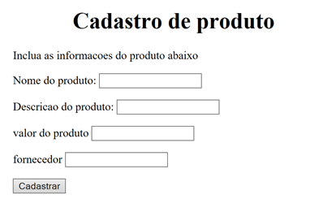

Caro estudante, no Capítulo 3 estudamos sobre como vincular bancos de dados às páginas e como cadastrar registro no banco de dados.
 Vimos também os primeiros passos para obter dados de uma página HTML e salvá-los em um banco de dados. 
 Fizemos uma síntese sobre o que é HTML e apresentamos exemplos de códigos, o que poderá auxiliá-lo para desenvolver um código HTML para um cadastro de fornecedores para a empresa “Casa da Tecnologia”. 

 Baseie-se na imagem a seguir:

1.O título da página HTML deve ser “Casa da Tecnologia”.

2.Para a palavra “Cadastro de produto”, utilize o título 1.

